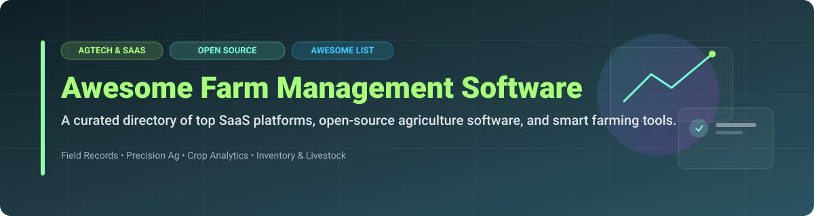

  

# 🌾 Awesome Farm Management Software 🚜

  
  
  
  
  

---

## 💡 Top Farm Management & Smart Agtech Ecosystem 🌐

> A curated directory of leading **Farm Management Software (FMS)**, **SaaS platforms**, **precision agriculture tools**, and **open-source AgTech solutions**. Designed for farmers, agronomists, digital agriculture researchers, and software engineers building the future of sustainable farming. 

**Last updated: September 2026** 📅

---

## 📑 Table of Contents

- [📈 Market Intelligence & Industry Overview](#-market-intelligence--industry-overview)
- [🏢 SaaS & Cloud Farm Management Platforms](#-saas--cloud-farm-management-platforms)
- [🔓 Open-Source Agriculture & Farming Software](#-open-source-agriculture--farming-software)
- [🤝 How to Contribute](#-how-to-contribute)
- [☕ Support & Sponsorship](#-support--sponsorship)
- [⚠️ Disclaimer](#%EF%B8%8F-disclaimer)
- [📈 Star History](#-star-history)

---

## 📈 Market Intelligence & Industry Overview

The global Farm Management Software market size is estimated at **$3.5 billion in 2026** and is projected to reach **$7.1 billion by 2031**, growing at a Compound Annual Growth Rate (CAGR) of **15.2%**.

> **Market Fragmentation:** The sector is **highly fragmented**. It is characterized by specialized regional players, corporate AgTech subsidiaries (e.g., Corteva, AGCO, Trimble), and niche precision tools rather than a single "winner-take-all" monolith.

---

## 🏢 SaaS & Cloud Farm Management Platforms

The commercial farm management ecosystem spans specialized suites for enterprise row-crop, specialty fruits/vegetables, satellite imagery, and livestock tracking.

| 🏢 Platform | 📝 Description | 💵 Starting Tier Pricing | 🎁 Free Tier / Trial Limit | 📊 Company Size (Valuation / Revenue) |
| :--- | :--- | :--- | :--- | :--- |
| **[Trimble Ag Software / PTx FarmENGAGE](https://agriculture.trimble.com/)** | Precision agriculture & farm operations platform for field records, machinery telematics & mapping. | **$1,788 / year** (Farmer Pro tier) | **No self-service free trial** (Dealer demo required) | **$13.7B Valuation** ($3.59B Revenue; Ag JV valued at $2.35B) |
| **[Granular](https://www.granular.ag/)** | Corteva farm business & agronomy software focused on profitability & seed performance. | **$499 / year** (Advanced Tiers) | **Granular Insights Free Tier** (Basic field profitability & seed tracking) | **$50.0B Valuation** (Parent Corteva, Inc.) |
| **[AgriWebb](https://www.agriwebb.com/)** | Livestock and pasture management platform for cattle and sheep operations. | **$45 / month** (Starter livestock tier) | **14-day Free Trial** (Full access, no credit card needed) | **$54.0M Valuation** (Acquired by Urus in 2026; ~$11.3M Rev) |
| **[Agworld](https://www.agworld.com/)** | Collaborative cloud farm-management platform connecting growers, agronomists & retailers. | **$1,495 / year** (Basic Grower Plan) | **7-day Free Trial** + **Free Viewer Tier** (For growers connected to agronomists) | **>$75.0M Valuation** (Acquired by Semios; >$100M AUD) |
| **[SourceTrace](https://www.sourcetrace.com/)** | Digital agriculture and farm management platform for supply chain & smallholder traceability. | **$250 / month** (Custom Enterprise Quote) | **Request-based Demo / Trial** (Consultation required) | **~$13.3M Revenue** (Privately held enterprise AgTech) |
| **[FarmERP](https://www.farmerp.com/)** | Enterprise agribusiness ERP covering operations, supply chain & financials. | **$300 / month** (Custom Enterprise Quote) | **Request-based Demo** (No permanent free plan) | **~$3.8M Revenue** ($1.99M Series A Funding) |
| **[Croptracker](https://www.croptracker.com/)** | Farm management software focused on harvest, labor tracking & compliance for specialty crops. | **$80 / month** (Module-based custom tier) | **Guided Demo / Trial** (Consultative onboarding) | **~$1.1M Revenue** (Privately held) |
| **[Conservis](https://www.conservis.ag/)** | Farm business management strong on inventory, grain tracking & operational oversight. | **$2,500 / year** (Enterprise quote) | **Request-based Demo** (Consultation required) | **Privately Held** (Acquired by Rabobank & TELUS in 2021) |
| **[EOS Crop Monitoring](https://eos.com/)** | Satellite-based crop monitoring & remote sensing analytics platform. | **$35 / month** (Professional Tier) | **Free Plan** (1 field up to 300 ha) + **14-day Trial** | **Privately Held** (Part of Noosphere Space Group) |
| **[Farmbrite](https://www.farmbrite.com/)** | All-in-one farm software for smaller diversified farms covering livestock, crops & finance. | **$29 / month** (Standard Plan) | **14-day Free Trial** (Full features, no credit card required) | **~$68.3K Revenue** (Privately held small business SaaS) |

---

## 🔓 Open-Source Agriculture & Farming Software

Open-source AgTech empowers growers, research institutions, and smallholders with self-hosted record-keeping, offline capabilities, and data sovereignty.

- **[OpenFarm](https://github.com/openfarmcc/OpenFarm)**  
    
  🌐 Free and open crowd-sourced database and web application for farming and gardening knowledge.

- **[farmOS](https://github.com/farmOS/farmOS)**  
    
  🚜 Mature, community-driven Drupal-based web application for farm record keeping, mapping, sensors, assets, and yield tracking.

- **[Tania](https://github.com/usetania/tania)**  
    
  🌱 Open-source farm management system designed for smallholders, hydroponics, and indoor farming operations.

- **[LiteFarm](https://github.com/LiteFarmOrg/LiteFarm)**  
    
  🌾 Community-led open-source digital platform for sustainable and diversified farmers (developed with UBC).

- **[farmOS Field Kit](https://github.com/farmOS/field-kit)**  
    
  📱 Offline-first PWA and mobile companion app for in-field data entry with farmOS.

- **[farmOS.py](https://github.com/farmOS/farmOS.py)**  
    
  🐍 Python API client library for integrating sensor networks, scripts, and IoT equipment with farmOS.

- **[farmOS Aggregator](https://github.com/farmOS/farmOS-aggregator)**  
    
  📡 Open microservice for aggregating and managing data from multiple farmOS server instances.

---

## 🤝 How to Contribute

Contributions are warmly welcomed! Help keep this farm management directory accurate and comprehensive. 🌾

1. 🍴 **Fork** the repository.
2. 📝 **Add/Edit** entries in `README.md` following the standard table and badge structures.
3. 🔍 Ensure product descriptions, pricing, and links are verified.
4. 🚀 Submit a **Pull Request** with a clear explanation of changes.

---

## ☕ Support & Sponsorship

If you find this repository helpful for your AgTech research, farm operations, or software development, please consider supporting the project! 💖

- ⭐ **Star** this repository to increase visibility.
- 🔄 **Fork & Share** it with fellow growers, agronomists, and developers.
- ☕ **Sponsor the Maintainer**: [Buy me a coffee on GitHub Sponsors](https://github.com/sponsors/ishandutta2007) to support open-source AgTech research!

---

## ⚠️ Disclaimer

- This repository is a **community-curated list** for informational and educational purposes.
- Farm management software selection involves operational, compliance, and agronomic choices. Always verify current commercial pricing, features, and contract terms directly with the vendors.

---

## 📈 Star History

---

  Made with ❤️ for growers, agronomists, and open-source agriculture advocates.

